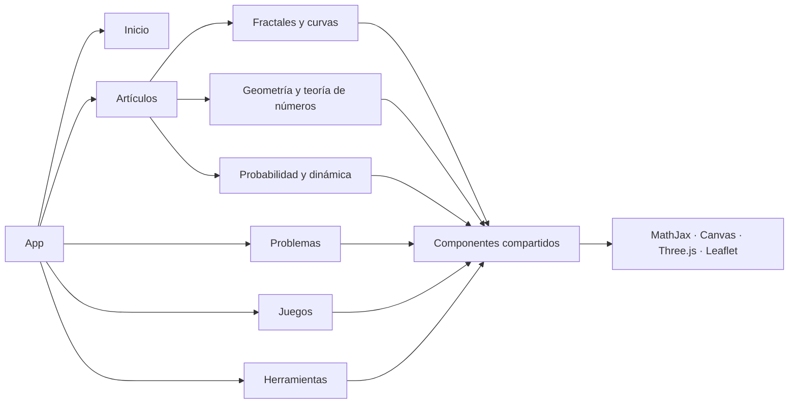

<div align="center">

# DaniSagan Labs

### Un zoológico matemático para explorar, visualizar y experimentar

[](https://angular.dev/)
[](https://www.typescriptlang.org/)
[](https://danisagan.github.io/dani.sagan.labs/)
[](https://github.com/DaniSagan/dani.saga.labs/commits/master)
[](https://github.com/DaniSagan/dani.saga.labs)

**Matemáticas · Fractales · Simulaciones · Visualización · Juegos · Herramientas**

[Explorar la demo](https://danisagan.github.io/dani.sagan.labs/) · [Ver artículos](https://danisagan.github.io/dani.sagan.labs/articles) · [Abrir una incidencia](https://github.com/DaniSagan/dani.saga.labs/issues/new)

</div>

---

## ¿Qué es DaniSagan Labs?

DaniSagan Labs es una aplicación web educativa que convierte conceptos abstractos en experiencias interactivas. Reúne artículos, visualizaciones, simulaciones, herramientas y juegos en un único laboratorio construido con Angular.

El proyecto cubre desde teoría de números y geometría hasta sistemas dinámicos, curvas, fractales y modelos tridimensionales. La intención es sencilla: **aprender observando el comportamiento de las matemáticas y modificando sus parámetros**.

> [!NOTE]
> Este proyecto es también un homenaje a la recientemente desaparecida **epsilones.com**. Cuando era joven y comenzaba la universidad, aquella página fue una de las mayores influencias en el nacimiento y desarrollo de mi pasión por las matemáticas. DaniSagan Labs aspira a mantener vivo algo de aquel espíritu de curiosidad, divulgación y descubrimiento.

> [!TIP]
> No hace falta instalar nada para empezar: visita la [aplicación publicada](https://danisagan.github.io/dani.sagan.labs/).

## Contenido

| Área | Qué encontrarás | Algunos ejemplos |
| --- | --- | --- |
| **Fractales** | Construcciones iterativas y exploradores visuales | Mandelbrot, Julia, Sierpiński, Koch, Hilbert, Barnsley, Menger |
| **Curvas** | Curvas clásicas y trazados paramétricos | Cardioide, cicloide, astroide, espirales, Lissajous, lemniscata |
| **Teoría de números** | Teoremas, identidades y ejemplos desarrollados | Euler, Fermat, Bézout, residuos cuadráticos, función de Möbius |
| **Geometría** | Polígonos, cónicas, sólidos y resultados clásicos | Teorema de Ptolomeo, polígonos regulares, sólidos platónicos |
| **Probabilidad y dinámica** | Experimentos computacionales | Percolación, bifurcaciones, atractor de Lorenz |
| **Herramientas** | Utilidades matemáticas y de visualización | Graficador, curvas implícitas, decimales de π, posición solar |
| **Juegos** | Algoritmos y lógica convertidos en experiencias jugables | Sudoku, Game of Life, Rubik, tres y cuatro en raya |

<details>
<summary><strong>Ver capacidades destacadas</strong></summary>

- Renderizado de fórmulas LaTeX mediante MathJax.
- Gráficos 2D interactivos basados en Canvas.
- Escenas y modelos tridimensionales con Three.js.
- Mapas y planificación geográfica con Leaflet.
- Componentes standalone combinados con módulos cargados de forma diferida.
- Navegación temática para artículos, problemas, juegos y herramientas.
- Diseño adaptable para escritorio y dispositivos móviles.

</details>

## Tecnología

| Capa | Tecnologías |
| --- | --- |
| Aplicación | Angular 17, TypeScript 5.4, RxJS |
| Interfaz | Angular Material, Bootstrap, CSS |
| Matemáticas | MathJax, big.js |
| Visualización | Canvas API, Three.js |
| Geografía | Leaflet |
| Pruebas | Jasmine, Karma |
| Publicación | GitHub Pages |

## Arquitectura

La aplicación separa las grandes áreas en módulos con carga diferida y conserva los elementos reutilizables en componentes compartidos y widgets.



```text
src/app/
├── articles/      # Artículos y demostraciones matemáticas
├── games/         # Juegos de lógica y simulación
├── problems/      # Problemas y ejercicios
├── tools/         # Herramientas interactivas
├── shared/        # Componentes reutilizables
├── widgets/       # Visualizaciones y controles especializados
├── home/          # Portada de la aplicación
└── app-routing.module.ts
```

## Inicio rápido

### Requisitos

- [Node.js](https://nodejs.org/) compatible con Angular 17.
- npm, incluido con Node.js.
- Git.

### Instalación

```bash
git clone https://github.com/DaniSagan/dani.saga.labs.git
cd dani.saga.labs
npm ci
npm start
```

Abre [http://localhost:4200](http://localhost:4200). El servidor recargará la aplicación al detectar cambios.

> [!NOTE]
> `npm ci` instala exactamente las versiones registradas en `package-lock.json`, por lo que es la opción recomendada para una instalación reproducible.

## Comandos disponibles

| Comando | Descripción |
| --- | --- |
| `npm start` | Inicia el servidor local de desarrollo |
| `npm run build` | Genera el bundle optimizado de producción |
| `npm run watch` | Compila en modo desarrollo y observa cambios |
| `npm test` | Ejecuta las pruebas con Karma en modo interactivo |
| `npm run test:ci` | Ejecuta las pruebas una vez en Chrome Headless |

El resultado de producción se genera en `dist/dani.sagan.labs/`.

## Cómo añadir contenido

La mayoría de las experiencias siguen una estructura basada en componentes Angular:

1. Crea el componente dentro del área temática correspondiente.
2. Define su título y ruta cuando forme parte del catálogo de artículos.
3. Registra la ruta en el módulo de navegación de su sección.
4. Reutiliza los componentes de `shared/` para fórmulas y elementos comunes.
5. Añade pruebas cuando incorpores lógica o interacción nueva.

Para generar una base con Angular CLI:

```bash
npx ng generate component articles/area/nuevo-articulo
```

## Contribuir

Las correcciones, propuestas de nuevos experimentos y mejoras de accesibilidad o rendimiento son bienvenidas.

1. Haz un *fork* del repositorio.
2. Crea una rama descriptiva: `git switch -c feature/nombre-del-experimento`.
3. Implementa y prueba el cambio.
4. Usa mensajes de commit claros y concretos.
5. Abre un *pull request* explicando el objetivo y, si cambia la interfaz, incluye una captura.

También puedes consultar las [incidencias abiertas](https://github.com/DaniSagan/dani.saga.labs/issues) o proponer una idea nueva.

## Hoja de ruta

- [x] Catálogo de artículos matemáticos interactivos.
- [x] Exploradores de fractales, curvas y sólidos 3D.
- [x] Secciones independientes de herramientas y juegos.
- [x] Fórmulas matemáticas renderizadas con MathJax.
- [ ] Ampliar la cobertura de pruebas automatizadas.
- [ ] Mejorar progresivamente accesibilidad y navegación por teclado.
- [ ] Incorporar más problemas guiados y demostraciones interactivas.

## Estado y licencia

El proyecto está en desarrollo activo: algunas áreas pueden evolucionar, cambiar de ruta o recibir nuevos experimentos.

> [!IMPORTANT]
> Actualmente el repositorio no incluye un archivo de licencia. La ausencia de una licencia explícita implica que se reservan los derechos sobre el código. Si quieres reutilizar una parte sustancial del proyecto, contacta primero con el autor.

---

<div align="center">

Hecho con curiosidad, Angular y muchas matemáticas.

⭐ Si el laboratorio te resulta útil, puedes apoyar el proyecto dando una estrella al repositorio.

</div>
